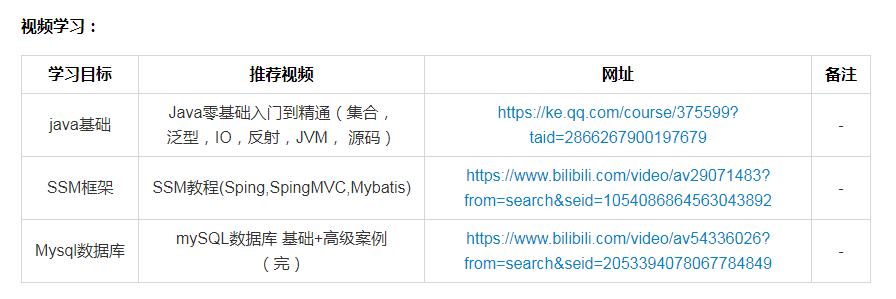

# 分享计划 {ignore}
[toc]

## 学习分享
### 1. 前端基础组
- 前端简介：
&emsp;&emsp;前端开发是**创建Web页面或app等前端界面**呈现给用户的过程，通过HTML，CSS及JavaScript以及衍生出来的各种技术、框架、解决方案，来**实现互联网产品的用户界面交互** 。它从网页制作演变而来，名称上有很明显的时代特征。在互联网的演化进程中，网页制作是Web1.0时代的产物，早期网站主要内容都是静态，以图片和文字为主，用户使用网站的行为也以浏览为主。随着互联网技术的发展和HTML5、CSS3的应用，现代网页更加美观，交互效果显著，功能更加强大。
- 分享计划：

  1. html、css、javascript基础学习，分别一周、两周、三周学习时间
  2. jquery、vue等框架学习，两周
  3. 小程序端学习，一周

- 分享形式

  笔记或ppt等，只要将学习内容讲清楚就行，形式不作要求。

### 2. 后台基础组
后台简介：
&emsp;&emsp;后台，指网站后台，有时也称为网站管理后台，是指用于管理网站前台的一系列操作，如：**产品、企业信息的增加、更新、删除等**。动态网页一般指的就是后台和静态页面结合的网页。例如，我们最常用的淘宝，最初我们进入我们“个人中心”的时候，服务端会将我们的个人信息，例如，访问记录，积分，收藏等等从数据库中查找出来然后发送给我们的页面，一般是json，最终效果就是我们看到的页面数据。一般我们刷不出页面，出现404的问题是因为我们网络不好，无法发送请求到服务端也就是我们的后台，导致数据无法到达我们的网页。如果后台崩溃，最后，后台就是一个接受数据，然后和数据库合作进行增删改查操作。

- 分享计划：
1. java基础学习：一共有11个部分，一共12周
2. Mybatis Spring SpringMVC：3个大部分
3. Mysql数据库：52个部分

分享形式：
笔记或ppt等，只要将学习内容讲清楚就行，形式不作要求。

主要学习：

### 3. 项目组
&emsp;&emsp;包括前端后台，相互配合完成完整web网站搭建。

1. 组织练手项目（华俱主页）
- 时间
- 负责人
2. 外接睿思项目

### 4. Android
1. 华俱Android端
2. 外接兼职订单

### 5. C++
主要是基础学习

## 9周年庆

1. 九周年各组节目开始准备了，时间在11月中旬，要求：参与的同学尽量多一些，正能量一些，把大家的才艺都展示出来。
2. 小组分享会这个月继续开展，每组至少进行一次分享。
4. 各组娱乐活动可以继续组织一下，周末可以一起约着出去玩。（天再冷了就不好约了）

## 分组统计
姓名|分组
:-:|:-:
陈晓月|前端
陈奋增|c++
侯少龙|后台
唐华|c++
曹宁|后台
张凯明|后台
李笑笑|后台
